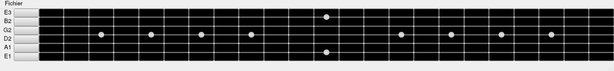

VMGB - Virtual Midi Guitar Board
================================

This program, inspired by the [VMPK project](https://vmpk.sourceforge.io/), provide a
virtual guitar fretboard to play MIDI notes.

This project is still in development, check the [Projects Tab](https://github.com/neimheadh/VMGB/projects?type=new)
to know the progress.
